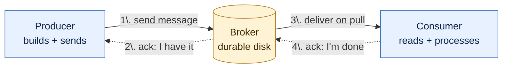

# Messaging Fundamentals

> Hub for section 1. Every note in this section links back here.

## What this section covers

The basics of messaging — before any protocol or product. Just programs talking to each other.

## Section flow

The whole story of this section in one picture: producer creates a message, broker stores it durably, consumer pulls and processes it. Two acks protect the two boundaries.

**Two acks, two boundaries:**

- `2.` protects **producer↔broker** — *"the broker has it safely on disk"*
- `4.` protects **consumer↔broker** — *"the consumer is done with it"*

Pulling either ack out reintroduces silent loss. Together they enable [[Delivery Semantics|at-least-once]] + [[Idempotency]].

## Notes (in order)

- [[The Raw Substrate]] — three programs, two wires, bytes on the wires
- [[Producer]] — the program that creates and sends messages
- [[Messages]] — what a message actually is
- [[Broker]] — the program with disks that stores and delivers messages
- [[Consumer]] — the program that reads and processes messages
- [[Command]] — a message that says *"do this"*
- [[Event]] — a message that says *"this happened"*
- [[Notification]] — a message that informs a known audience, usually external
- [[Query]] — a message that asks for information and waits for a reply
- [[Delivery Semantics]] — at-most-once, at-least-once, exactly-once
- [[Idempotency]] — safe re-processing

## Where this fits

This is **section 1 of 11** in the full path. Sections 2 and 3 cover TCP and AMQP.
