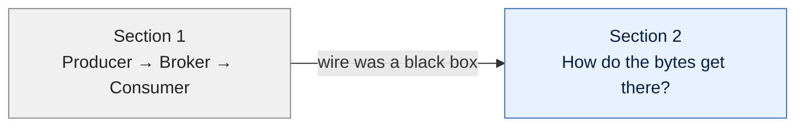
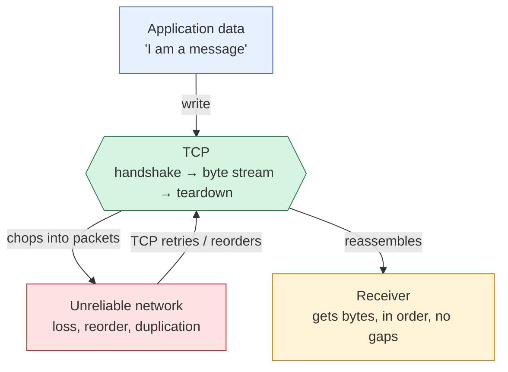

# Transport Fundamentals

> Hub for section 2. The wire underneath everything.

## What this section covers

Before AMQP makes sense, we need to be solid on the floor it stands on — TCP. This section answers two things:

1. What does TCP actually deliver?
2. What does TCP **not** deliver, and why does that matter for AMQP?

## Bridge from Section 1

[[Messaging Fundamentals|Section 1]] talked about producer, broker, consumer as if they were just *talking* — no detail on **how the bytes actually move**. That handwave is what Section 2 fills in.

## Section flow

TCP gives you a **byte pipe**: ordered, lossless, no duplicates. But it gives you *only* bytes — no message boundaries, no auth, no acks at the message level.

**What TCP gives you:** ordered, no-loss, no-duplicate **bytes**.
**What TCP does *not* give you:** where one message ends and the next begins, who you're talking to (auth), or whether the *application* on the other end actually got it.

That gap is exactly why [[AMQP Fundamentals|Section 3]] exists.

## Notes (in order)

- [[TCP]] — reliable byte transport; what it gives, what it doesn't
- [[Reliable Byte Transport]] — what "reliable" really means (the four failure modes, head-of-line blocking, the speed tradeoff)
- [[TCP Connections]] — handshake, state, teardown

## Where this fits

Section **2 of 11**. Section 1 was messaging concepts. Section 3 is AMQP — which exists to fill the gaps TCP leaves open.

[[Index]]
