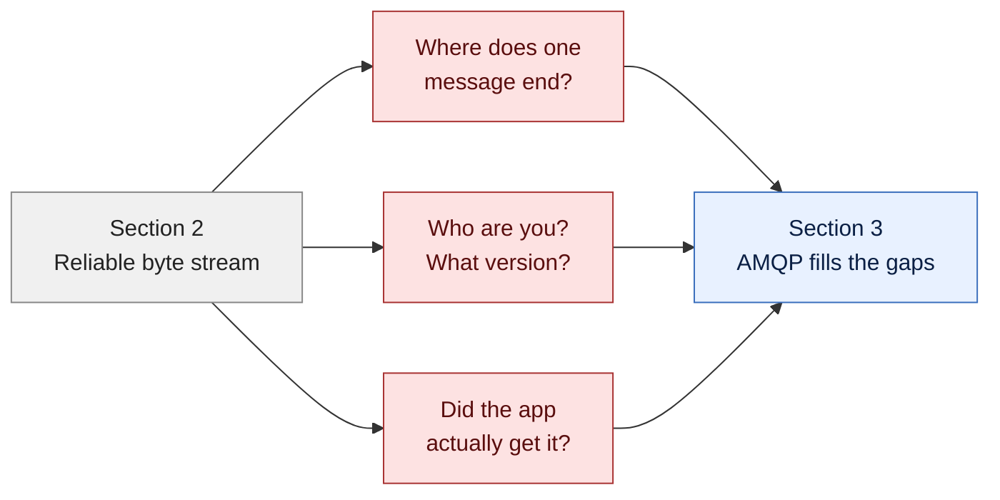
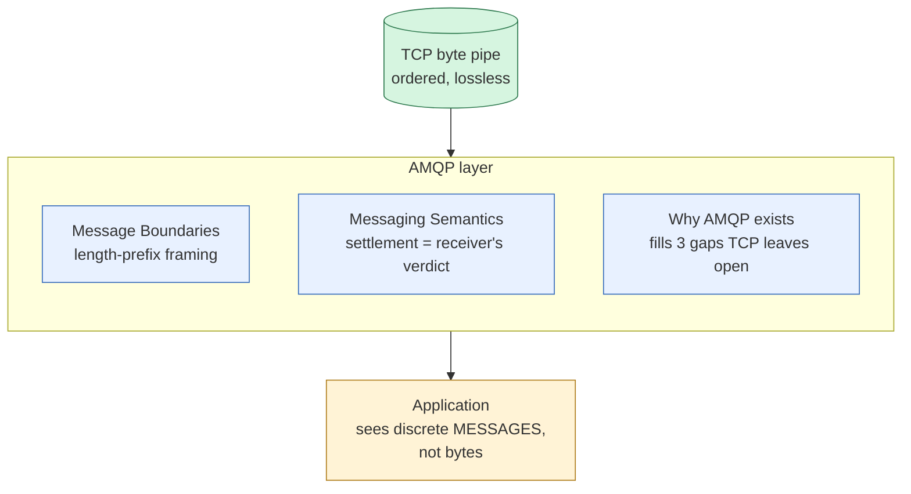
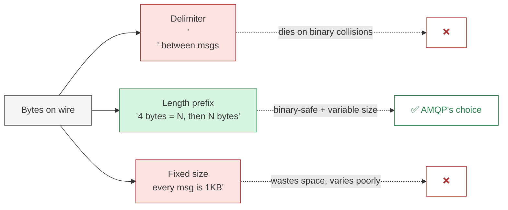
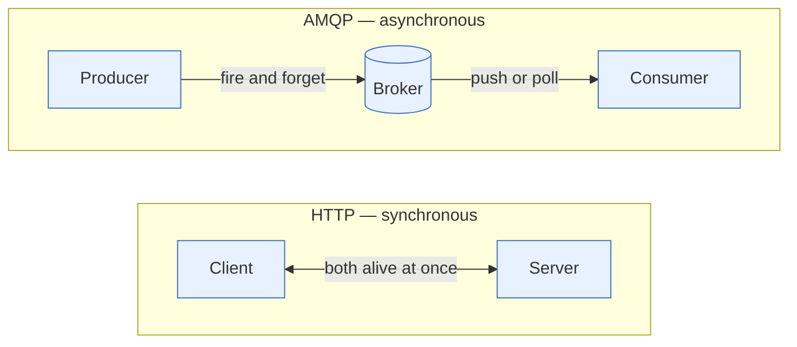

# AMQP Fundamentals

> Hub for section 3. Why we need a protocol on top of TCP, and what AMQP adds.

## What this section covers

[[TCP]] gave us reliable bytes. [[TCP Connections]] gave us a stable conversation. But bytes alone aren't messages. This section is the bridge from "bytes on a wire" to "messages with structure."

## Bridge from Section 2

Section 2 left us with reliable bytes. Three problems remain.

## Section flow

AMQP is a **message-oriented protocol on top of TCP**. It adds three things TCP doesn't give: message boundaries, identity/version, and message-level acknowledgement (settlement).

**The three framing schemes** AMQP could have picked, and why it picked length-prefix:

**HTTP vs AMQP — same TCP, different *shape* of work.** This is a shape difference, not a speed difference:

The five consequences fall out of the shape: temporal decoupling, fan-out, push vs poll, credits/backpressure, two-stage settlement. None of these work in pure HTTP without bolting on a queue.

## Notes (in order)

- [[Why AMQP Exists]] — the gaps TCP leaves open and how AMQP fills them
- [[AMQP vs TCP]] — message-oriented on top of byte-oriented
- [[Message Boundaries]] — where one message ends and the next begins
- [[Messaging Semantics]] — what AMQP promises about delivery
- [[AMQP vs HTTP]] — same TCP, different shape of work

## Where this fits

Section **3 of 11**. Section 2 was the wire (TCP). Section 4 is AMQP's transport layer (connections, sessions, links, frames).

[[Index]]
