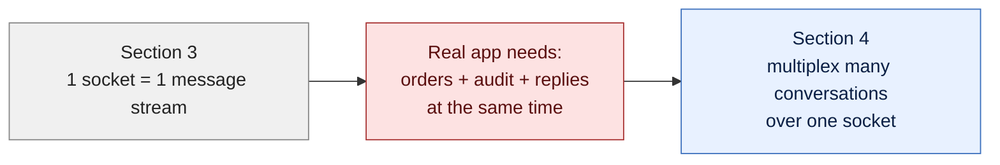
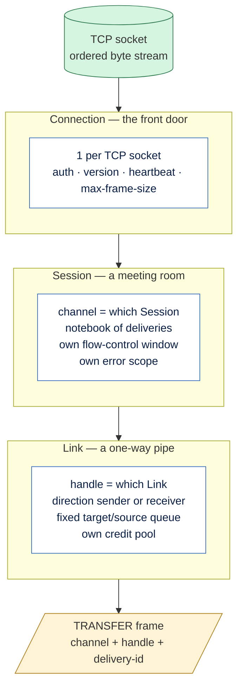
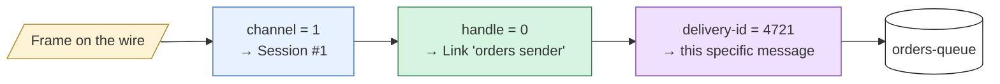
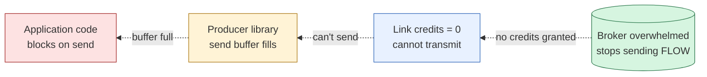

# AMQP Transport Layer

> Hub for section 4. The four layers AMQP uses to multiplex many conversations over one TCP connection.

## What this section covers

Section 3 left us with one producer, one broker, one TCP connection, length-prefixed messages flowing safely. Section 4 breaks that picture, because real apps run **many conversations at once** through a single broker — orders, audit, replies, notifications — and need a way to keep them isolated without opening a TCP connection per conversation.

The answer is multiplexing, organised in three nested layers — Connection, Session, Link — that ride on top of TCP, with Frames as the unit of bytes that carries the multiplexing tag.

## Bridge from Section 3

Section 3 gave us length-prefixed messages on one TCP socket — but only **one conversation per socket**. Real apps need many.



## Section flow — the four layers

Three nested layers ride on top of TCP. Frames are the byte units that carry the multiplexing tags.



## Routing on every TRANSFER frame

Three small integers, three layers of routing. Read them top-down to find the destination.



## Backpressure path (the credits story)

When the broker can't keep up, it just stops granting credits — and pressure flows backward all the way to the application code, automatically.



## The four layers, summarised

```
TCP socket          ──  ordered, lossless byte stream  (the OS provides this)
 └── Connection     ──  one per socket; auth, version, heartbeat, max-frame-size
      └── Session   ──  conversation context; channel# scoped per Connection;
      │                 notebook of deliveries (delivery-id, settlement state)
      │                 own flow-control window, own error scope
      │
      └── Link      ──  one-way pipe; handle# scoped per Session;
                        fixed direction (sender / receiver),
                        fixed address (target / source),
                        own credit pool for fine-grained flow control
```

Every TRANSFER frame on the wire carries three identifiers, one per layer:

```
(channel = which Session) → (handle = which Link) → (delivery-id = which message)
```

That is the whole multiplexing story: three nested namespaces, each with its own scope, each solved with one small integer per frame.

## Frame types across the section

The verbs (performatives) that appear in this section's frame bodies:

| Performative | Layer | Opens / closes / does |
|---|---|---|
| `OPEN` / `CLOSE` | Connection | Open / close the Connection |
| `BEGIN` / `END` | Session | Open / close a Session |
| `ATTACH` / `DETACH` | Link | Open / close a Link |
| `TRANSFER` | Link | Carry a message (or part of one) |
| `DISPOSITION` | Session | Settle a delivery (accepted/rejected/released/modified) |
| `FLOW` | Link / Session | Update credits or window state |

Header is always the same shape (size, DOFF, type, channel). The body's performative is what varies.

## Notes (in order)

- [[Connection]] — the front door: one per TCP socket, owns auth/version/heartbeat
- [[Frames]] — what AMQP actually writes to TCP, channel-tagged for routing
- [[Session]] — a conversation context, the notebook of deliveries
- [[Link]] — a one-way pipe inside a Session for actual message flow

## Where this fits

Section **4 of 11**. Section 3 explained why AMQP exists. This section explains how AMQP organises a single TCP pipe into many isolated conversations. Section 5 (Message Transfer) builds on top to show how a single message moves through Link → Session → Frames → wire and back.

[[Index]]
