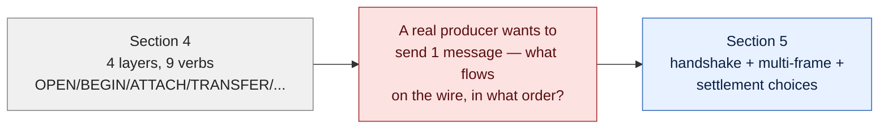
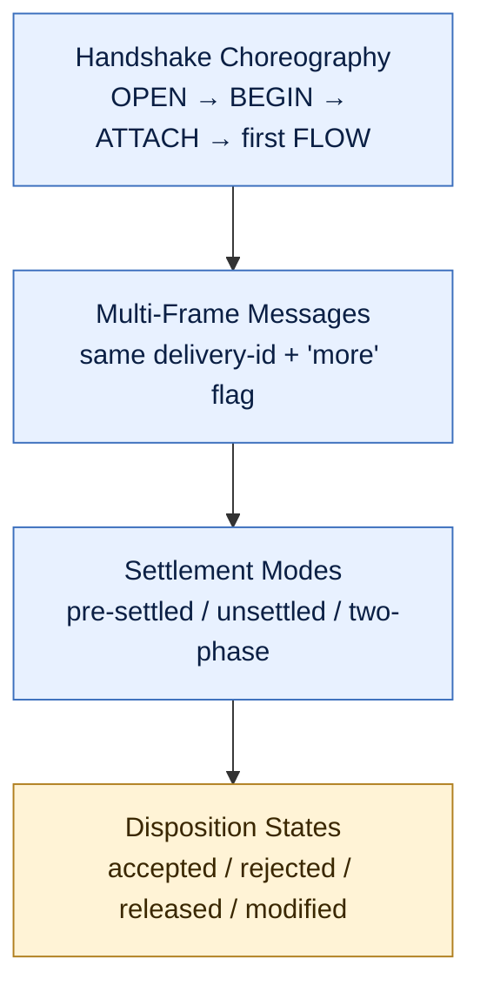

# AMQP Message Transfer

> Hub for section 5. Section 4 gave us the four layers (Connection, Session, Link, Frames). This section is what *actually happens on the wire* when you send a message — the handshake, the multi-frame mechanics, and the settlement choices that decide your safety vs. cost tradeoff.

## What this section covers

Three pieces, each answering one question a real Service Bus engineer hits:

1. **How many frames does it take to send my first message?** — handshake choreography
2. **What happens when my message is bigger than `max-frame-size`?** — multi-frame transfers
3. **Is the DISPOSITION round-trip optional?** — settlement modes (and how they map to Service Bus's `PeekLock` vs `ReceiveAndDelete`)

A fourth piece — **disposition states** (accepted / rejected / released / modified, which map onto Service Bus's `Complete` / `DeadLetter` / `Abandon`) — is on the way as a separate note.

## Bridge from Section 4

Section 4 gave us the *shape* — Connection wraps Sessions wraps Links wraps Frames. But it didn't show what flows on the wire when a producer actually sends a message.

## Section flow

## Notes (in order)

- [[Handshake Choreography]] — the 4 frames out + 5 frames back to send the first message; channel 0 = Connection control; mirrored frames = parameter negotiation; setup amortises across thousands of messages
- [[Multi-Frame Messages]] — `max-frame-size` is a buffer contract; one delivery glued across N frames by stable `delivery-id` + `more=true/false`; partial buffers silently discarded on Connection loss
- [[Settlement Modes]] — three modes (pre-settled / unsettled / two-phase) on a cost-vs-safety axis; `>99%` of production runs unsettled (= `PeekLock`); Service Bus does exactly-once via broker dedup, not protocol Mode 3
- Disposition States — *coming in next note*

## Where this fits

Section **5 of 11**. Section 4 explained the layered shape. This section explains what flows through that shape on the wire. Section 6 (Message Lifecycle) zooms in on what happens *between* "broker received it" and "consumer is done with it" — the lock/timeout/redeliver dance you actually write code against in Service Bus.

[[Index]]
