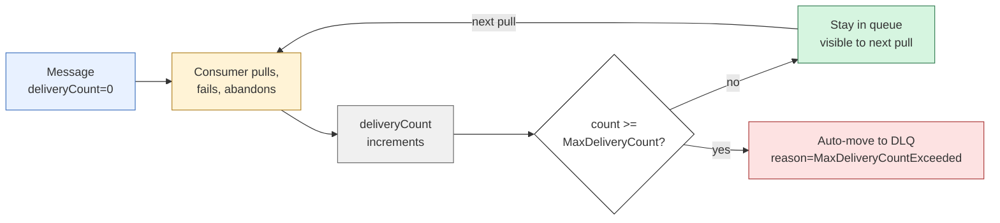

---
tags:
  - amqp
  - transport
---

# Disposition States

> **A disposition state is the receiver's verdict on a delivery — there are exactly four.** Accepted (delete it), rejected (poison message, send to DLQ), released (transient failure, requeue), modified (requeue with updated metadata). These four states cover every normal outcome of message handling, and they map directly onto Service Bus consumer operations: `Complete` / `DeadLetter` / `Abandon` / `Abandon-with-properties`. Every Service Bus message-handling loop you ever write is, underneath, a switch on these four states.

## Definition

A **disposition state** is the value carried in the DISPOSITION frame's `state` field that tells the broker what to do with a delivery the receiver has handled. AMQP defines exactly four terminal states for a delivery handled by a receiver:

- **`accepted`** — the receiver processed the message; remove it from the queue.
- **`rejected`** — the receiver refuses to process the message; do not redeliver to anyone.
- **`released`** — the receiver did not process the message; redeliver it.
- **`modified`** — same as released, plus updates to the message's metadata.

Each state is a tiny enum on the wire, but the broker's reaction to each is dramatically different — and consumer code has to pick the right one for every message it sees.

## Problem it solves

[[Settlement Modes]] established that the receiver sends a DISPOSITION frame to close a delivery's lifecycle. But "lifecycle closed" isn't enough — the broker has to *do* something with the message: keep it, drop it, requeue it, dead-letter it. The state field is what converts a settlement event into a routing decision.

Without explicit states, a consumer would have only two crude options:

1. **Acknowledge** — message handled, broker can forget it.
2. **Don't acknowledge** — broker keeps redelivering until the lock expires or the connection breaks.

That's not enough for real systems. A consumer needs to distinguish:

| Real outcome | What broker should do |
|---|---|
| Worked | Delete |
| Permanently broken (poison) | Move to DLQ, never redeliver |
| Transient failure (DB blip) | Requeue, give someone else a chance |
| Transient + add context | Requeue with retry counter or annotation |

A binary ack/nack can express the first; not the rest. Disposition states give the consumer four explicit verbs the broker honors deterministically.

## Why previous solution was insufficient

Some earlier protocols (RabbitMQ pre-AMQP, JMS legacy modes) had only "acknowledge" and "reject," with reject's behavior either configurable globally on the queue or interpreted differently by every client library. The result was non-portable code: switching brokers or even SDK versions changed how rejection behaved.

AMQP's four-state model fixes this by:

- Making each state's broker-action **part of the protocol spec**, not the queue config.
- Giving consumers per-message control instead of per-queue settings.
- Carrying error details and metadata *inside the DISPOSITION frame*, so the consumer's intent is fully self-contained.

The receiver no longer has to think "did the broker config make rejection mean DLQ or requeue?" The state itself answers it.

## The four states in detail

### `accepted` — the happy path

> *"I successfully processed this message. Delete it."*

```
Consumer ──► DISPOSITION (delivery-id=42, state=accepted) ──► Broker
                                                              │
                                                          deletes msg from queue
```

| Property | Value |
|---|---|
| **Service Bus equivalent** | `await receiver.complete_message(msg)` |
| **Broker action** | Delete the message; nobody else will ever see it |
| **When to use** | After your processing succeeded and downstream effects are committed |
| **Error info on the wire** | None |

After `accepted` is settled, the message is gone. There is no recovery — if your process crashes one millisecond after the broker deletes it, the message is not coming back. This is why important downstream effects (DB writes, payment captures) must be committed *before* you call `Complete`.

### `rejected` — poison message

> *"This message is broken. Don't try to deliver it again. Send it to the dead-letter queue."*

```
Consumer ──► DISPOSITION (delivery-id=42, state=rejected,
                          error={condition='amqp:precondition-failed',
                                 description='missing required field order_id'})
                                                                  ──► Broker
                                                                       │
                                                                  moves to DLQ
```

| Property | Value |
|---|---|
| **Service Bus equivalent** | `await receiver.dead_letter_message(msg, reason="...", error_description="...")` |
| **Broker action** | Move the message to the queue's `$DeadLetterQueue` sub-queue |
| **When to use** | Permanent failures — schema mismatch, missing required fields, deleted resource references, validation that won't pass on retry |
| **Error info on the wire** | `error.condition` (machine-readable code) + `error.description` (human text) + optional `error.info` map |

The error info isn't decorative — Service Bus surfaces it on the dead-lettered message as `DeadLetterReason` and `DeadLetterErrorDescription`, which your DLQ-monitoring code reads to diagnose what went wrong:

```python
dl_msg.application_properties[b'DeadLetterReason']            # b'schema-error'
dl_msg.application_properties[b'DeadLetterErrorDescription']  # b'missing order_id'
```

> **DLQ is your production debugger.** Every queue and subscription has one automatically (`<entity-name>/$DeadLetterQueue`). Wire up a DLQ alert before launching to production — silently growing DLQs are the most common Service Bus failure mode. Engineers who don't monitor DLQ get blindsided by silent message loss; engineers who do, see exactly which messages are misshapen and why.

### `released` — transient failure, try later

> *"I can't process this right now. Give it back. Someone else (or future-me) can try."*

```
Consumer ──► DISPOSITION (delivery-id=42, state=released) ──► Broker
                                                              │
                                                          requeues — delivery count++
```

| Property | Value |
|---|---|
| **Service Bus equivalent** | `await receiver.abandon_message(msg)` |
| **Broker action** | Release the lock; message becomes immediately available to other consumers; delivery count increments |
| **When to use** | Transient failures — DB connection dropped, downstream API rate-limited, dependency restarting, graceful shutdown |
| **Error info on the wire** | None |

The lock release is **immediate**, not lock-timeout-bounded. The message is visible to the next pull within milliseconds. This is why you should always abandon explicitly — letting locks expire silently means up to 30 seconds of stalled throughput on those messages.

#### Auto-DLQ on repeated abandons

Service Bus tracks per-message **delivery count**. Each abandon (or lock expiry) increments it. When it crosses **`MaxDeliveryCount`** (default 10), the broker auto-moves the message to DLQ with reason `MaxDeliveryCountExceeded`.



This is Service Bus's **automatic safety net for retry storms** — you don't have to write your own "give up after N tries" logic. The broker is doing it. A consumer that abandons the same message 10 times in a row will see it disappear into DLQ on the 11th attempt.

### `modified` — release with updated metadata

> *"I can't process this right now — give it back, and update its metadata so the next consumer has more context."*

```
Consumer ──► DISPOSITION (delivery-id=42, state=modified,
                          delivery-failed=true,
                          message-annotations={'retry-count': 3,
                                               'last-error': 'db-timeout'})
                                                                          ──► Broker
                                                                              │
                                                                       requeues with
                                                                       updated metadata
```

| Property | Value |
|---|---|
| **Service Bus equivalent** | `await receiver.abandon_message(msg, properties_to_modify={...})` |
| **Broker action** | Same as `released`, but the message's metadata is updated before requeue |
| **When to use** | Retry-counter patterns, distributed tracing, observability tags that travel with the redelivery |
| **Extra fields** | `delivery-failed` (boolean), `undeliverable-here` (boolean — bypass this consumer next time), `message-annotations` (key-value bag) |

In practice, **`released` is the common one**. `modified` shows up in advanced patterns where you want the next attempt to know "this was attempt #3" or "this consumer instance can't handle it, route around me."

## The mapping table

| Outcome | AMQP state | Service Bus method | Broker action |
|---|---|---|---|
| Success | `accepted` | `complete_message` | Delete from queue |
| Poison message | `rejected` | `dead_letter_message` | Move to DLQ |
| Transient failure | `released` | `abandon_message` | Requeue, increment delivery count |
| Transient + metadata | `modified` | `abandon_message(properties_to_modify=...)` | Requeue with updates |

If you remember nothing else from this note, remember this table. Every Service Bus consumer you write is, underneath, a switch over these four rows.

## Consumer-side settlement is fire-and-forget

A subtle but important consequence of the AMQP receiver model:

> **Once the consumer sends DISPOSITION, it considers the delivery settled — it does not wait for an ack from the broker.**

This is `rcv-settle-mode = first` (the default for Service Bus PeekLock). The consumer's library updates its internal state immediately after writing the DISPOSITION bytes; it doesn't track whether the broker received it.

Why? At worst, a lost DISPOSITION causes a **redelivery**:

- Consumer sends DISPOSITION(42, accepted).
- Network blip — broker never gets it.
- Lock on message #42 expires.
- Broker requeues, redelivers to *some* consumer (possibly the same one).
- Consumer processes it again. Idempotency absorbs the duplicate.

A redelivery is strictly better than a lost message. So tracking DISPOSITION acks would add complexity to defend against a failure mode that's already harmless.

> **Idempotency on the consumer is mandatory, not optional.** Even when you think `Complete` succeeded, a network blip can turn it into a redelivery to a different consumer instance. Your processing logic must be safe to run twice.

This is the consumer-side mirror of the producer-side rule from [[Idempotency]]. Both directions of the conversation are fire-and-forget at the AMQP layer; idempotency catches the duplicates that produces.

## Real-world example — typed error handling

A real Service Bus consumer that handles each disposition explicitly:

```python
async for msg in receiver:
    try:
        order = parse_order(msg.body)         # may raise SchemaError
        await db.write(order)                  # may raise ConnectionError
        await downstream.notify(order)         # may raise ApiTimeout
        await receiver.complete_message(msg)   # → accepted

    except SchemaError as e:
        # Permanent failure — schema is wrong, retry won't help
        await receiver.dead_letter_message(
            msg,
            reason="schema-error",
            error_description=str(e),
        )                                      # → rejected

    except (ConnectionError, ApiTimeout) as e:
        # Transient — circuit-break, then abandon
        await asyncio.sleep(backoff(msg.delivery_count))
        await receiver.abandon_message(msg)    # → released
        # delivery count auto-increments; auto-DLQ at MaxDeliveryCount

    except Exception as e:
        # Unknown — be conservative, treat as transient
        await receiver.abandon_message(msg)    # → released
```

Each `except` branch picks one of the four AMQP states. **You write no AMQP code** — but knowing the underlying state is what makes the `try`/`except` shape obvious. A consumer that calls `complete_message` on every failure to "keep the queue moving" is silently losing data; a consumer that calls `abandon_message` on every failure is creating retry storms. Knowing the four states is what tells you which to call when.

## Real-world example — graceful shutdown

A consumer running in Kubernetes receives `SIGTERM` (pod is being rescheduled). It has a few seconds before `SIGKILL` arrives. It's currently holding 8 messages under PeekLock.

**Wrong:** exit without telling Service Bus anything. The 8 messages stay locked for the rest of their lock duration (default 30s) — during which the rest of the consumer fleet can't touch them. The queue effectively stalls those messages.

**Right:** abandon all 8 explicitly:

```python
shutdown_event = asyncio.Event()
signal.signal(signal.SIGTERM, lambda *_: shutdown_event.set())

async for msg in receiver:
    if shutdown_event.is_set():
        await receiver.abandon_message(msg)   # release immediately
        continue
    await process_message(msg)
```

`released` releases the locks in milliseconds. The rest of the fleet picks them up immediately. **This is the difference between graceful shutdown and stalled queues.** Every production consumer needs it.

## Mental model

> **Four boxes the consumer can put a message in:**
>
> - **Done** (`accepted`) → outbox, broker shreds it
> - **Broken** (`rejected`) → DLQ box, never seen again unless someone manually fishes it out
> - **Not now** (`released`) → back to the queue, anyone can grab it
> - **Not now, but here's a sticky note** (`modified`) → back to the queue with extra annotations
>
> The broker doesn't try to be clever — it does exactly what the box label says. The consumer is responsible for picking the right box for each message.

## Interview answer

AMQP defines four disposition states the receiver can put on a DISPOSITION frame: accepted (broker deletes the message), rejected (broker moves to DLQ — used for poison messages), released (broker requeues — used for transient failures), and modified (released plus metadata updates). These map directly onto Service Bus's `Complete`, `DeadLetter`, `Abandon`, and `Abandon-with-properties` operations. Service Bus has an automatic safety net via `MaxDeliveryCount` (default 10): repeated abandons increment a per-message delivery counter, and crossing the threshold auto-DLQs the message — so you never have to write "give up after N tries" logic in your consumer. Consumer-side settlement is fire-and-forget (`rcv-settle-mode = first` by default), meaning the consumer doesn't wait for the broker to ack the DISPOSITION; at worst, a lost disposition causes a redelivery, which idempotency handles. Real consumer code is a `try`/`except` with each branch picking one of the four states, plus a graceful-shutdown handler that abandons in-flight messages on SIGTERM to release locks immediately rather than waiting 30 seconds for them to expire.

## Common misconceptions

- **"`accepted` means the message is durable somewhere else."** No. `accepted` means *the consumer's processing was successful*. It's the consumer's responsibility to ensure downstream effects are committed *before* sending `accepted` — otherwise you can lose data.
- **"`rejected` retries the message a few times before going to DLQ."** No. `rejected` goes straight to DLQ. The "retry first, then DLQ" behavior is `released` plus `MaxDeliveryCount` — a different state with different semantics.
- **"`released` is the same as letting the lock expire."** Behaviorally similar (both requeue), but `released` is immediate (milliseconds) while lock expiry takes the full lock duration (default 30s). Always release explicitly.
- **"Consumers should always wait for the DISPOSITION ack before considering the message done."** No. Consumer-side settlement is fire-and-forget. There is no DISPOSITION ack at the protocol level; idempotency handles the rare cases where the disposition is lost.
- **"`MaxDeliveryCount` is something I have to implement myself."** No. Service Bus enforces it automatically per-queue. Your job is to set the threshold, not to count abandons.
- **"`modified` is rarely useful."** Misleading. It's rare in simple consumers but standard in advanced patterns (distributed tracing, retry-counter persistence, consumer-affinity routing). The SDK's `properties_to_modify` parameter is exactly this state.
- **"DLQ messages are gone forever."** No. DLQ is a sub-queue (`<queue>/$DeadLetterQueue`) with the same shape as a regular queue. You can read from it, reprocess messages, even move them back to the main queue — Service Bus has explicit APIs for this.
- **"The four states are Service Bus inventions."** No. They are core AMQP. Service Bus's `Complete` / `DeadLetter` / `Abandon` are friendlier names for the underlying AMQP states.

## See also

- [[Settlement Modes]] — the parent concept that decides *whether* a DISPOSITION is sent at all; this note assumes Mode 2 (unsettled / PeekLock)
- [[Idempotency]] — the consumer-side defense that makes fire-and-forget settlement safe
- [[Delivery Semantics]] — the at-most-once / at-least-once framing that dispositions express on the wire
- [[Multi-Frame Messages]] — settlement is per-delivery, not per-frame; multi-frame is invisible to disposition states
- [[Handshake Choreography]] — where `rcv-settle-mode` is negotiated (in ATTACH)

## Index

[[AMQP Message Transfer]]
