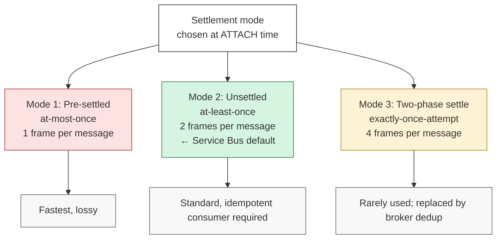

---
tags:
  - amqp
  - transport
---

# Settlement Modes

> **Settlement is the conversation that closes a delivery.** AMQP exposes three modes — pre-settled (1 frame, lossy), unsettled (2 frames, possibly duplicate), and two-phase (4 frames, theoretically perfect) — and lets you pick one per Link at ATTACH time. Real-world distribution is roughly 99% unsettled, ~1% pre-settled, and essentially 0% two-phase. Service Bus delivers exactly-once via broker-side dedup, not via the protocol's two-phase mode.

## Definition

A **settlement mode** is the per-Link choice negotiated at ATTACH time that determines how many frames are exchanged to close a delivery's lifecycle, and what guarantees that exchange provides. AMQP exposes two knobs (one per direction) — `snd-settle-mode` for the sender side and `rcv-settle-mode` for the receiver side — and three combined modes that result from them: **pre-settled**, **unsettled**, and **two-phase settle**.

Settlement happens at the *delivery* level, not the frame level. A multi-frame message has exactly one settlement event regardless of how many TRANSFER frames it spanned.

## Problem it solves

[[Multi-Frame Messages]] showed how messages get on the wire. But the on-wire mechanics don't say anything about *how careful* both ends should be about confirming the handover. Real applications have wildly different needs:

- **Telemetry / metrics**: 1M msg/sec, losing 0.01% is acceptable, every extra frame is wire and CPU cost we don't want to pay.
- **Orders / payments**: losing one is unacceptable; duplicating is recoverable through idempotency.
- **Financial settlement**: ideally never duplicate, never lose; willing to pay extra frames for the strongest possible guarantee.

A single settlement protocol can't serve all three. AMQP's answer: expose the choice as a per-Link mode, let the application pick at ATTACH.

## Why previous solution was insufficient

A naive design would force one mode for everyone. Two flavors:

| Forced mode | What breaks |
|---|---|
| **Always confirm** (always send DISPOSITION) | Telemetry pays 2× wire cost for a guarantee it doesn't need. At 1M msg/sec, that's 1M extra DISPOSITION frames/sec — significant CPU and bandwidth on both ends. |
| **Never confirm** (fire-and-forget) | Important messages can vanish silently. The producer has no way to know whether its order was persisted. Retry logic becomes impossible — should I retry? I don't know if it arrived. |

Either choice is wrong for one of the workloads. The right design surfaces the choice and lets the application pick — exactly like [[Delivery Semantics]] (at-most-once / at-least-once / exactly-once) but expressed at the protocol level.

## Responsibilities

Settlement mode owns:

- **Frame count per delivery** — 1 frame (pre-settled), 2 frames (unsettled), 4 frames (two-phase).
- **Guarantee** — at-most-once, at-least-once, or exactly-once-attempt.
- **Producer-side memory** — whether the sender can drop the delivery from its unsettled set immediately or must wait.
- **Receiver-side dedup memory** — only two-phase requires the receiver to remember accepted delivery-ids.

What it does *not* own:

- **Disk durability** — that's the receiver's persistence layer, separate from settlement (see [[Session]]'s "settled ≠ durable" anchor).
- **Routing** — the Link's `target` decides where a message goes, not the settlement mode.
- **Cross-message dedup over long time windows** — that's broker-level duplicate detection (Service Bus's `RequiresDuplicateDetection` queue setting), independent of the AMQP protocol mode.

## The three modes



### Mode 1 — Pre-settled (at-most-once)

The sender marks the delivery as `settled=true` directly on the TRANSFER frame. There is no DISPOSITION. The sender forgets the delivery the moment it writes the bytes to TCP.

```
Producer ──► TRANSFER (settled=true, body=...) ──► Broker
   │                                                   │
   forgets immediately                          stores the message
```

| Property | Value |
|---|---|
| **Frames per message** | 1 |
| **Worst case** | Lost message (TCP fails / broker crash before disk write) |
| **Sender memory** | None (delivery dropped instantly) |
| **Receiver memory** | None (no dedup needed) |
| **Service Bus name** | `ReceiveMode.ReceiveAndDelete` (consumer-side equivalent) |
| **Use cases** | Telemetry, metrics, log shipping where loss is acceptable |

This is the same delivery semantics as UDP — fire and forget. Production use is rare and limited to high-volume, loss-tolerant streams.

### Mode 2 — Unsettled (at-least-once) — the default

The sender marks `settled=false` on TRANSFER, holds the delivery in its unsettled set, waits for DISPOSITION. The receiver writes the message to disk, then sends a DISPOSITION carrying the verdict (`accepted` / `rejected` / `released` / `modified` — those are *disposition states*, covered separately).

```
Producer ──► TRANSFER (settled=false, delivery-id=42) ──► Broker
   │                                                       │
   keeps delivery 42 in                                   writes to disk
   unsettled set                                          ┌──┴──┐
                                                          │     │
   ◄── DISPOSITION (delivery-id=42, accepted) ◄────────  ─┘     │
   │                                                            │
   drops delivery 42                                       broker has
   from unsettled set                                      it durably
```

| Property | Value |
|---|---|
| **Frames per message** | 2 |
| **Worst case** | Duplicate message (DISPOSITION lost in transit, producer retries on reconnect) |
| **Sender memory** | Unsettled set until DISPOSITION arrives |
| **Receiver memory** | None at the protocol level (broker-side dedup is a separate feature) |
| **Service Bus name** | `ReceiveMode.PeekLock` (the standard mode) |
| **Use cases** | Default for everything important — orders, payments, audit logs, notifications |

This is **the** mode for production messaging. Combined with [[Idempotency]] on the consumer side (or broker-side duplicate detection), it gives the standard "no loss; duplicates absorbed" guarantee that >99% of real systems need.

### Mode 3 — Two-phase settle (exactly-once attempt)

Four frames. Sender sends unsettled, receiver dispositions but stays unsettled, sender then settles, receiver acks the settle.

```
Producer ──► TRANSFER (settled=false)             ──► Broker
        ◄── DISPOSITION (accepted, settled=false)  ◄──
        ──► DISPOSITION (settled=true)             ──►
        ◄── DISPOSITION (settled=true)             ◄──
```

Each step adds a guarantee:

- After step 2: receiver knows it's accepted, but sender hasn't *committed* the settlement yet.
- After step 3: sender has committed; if a duplicate arrives, the receiver can match it against its memory of "I already accepted delivery-id=42" and reject it as a duplicate.
- After step 4: both sides agree, both can drop tracking.

| Property | Value |
|---|---|
| **Frames per message** | 4 |
| **Worst case** | None (theoretically) — receiver's memory of accepted ids prevents duplicates |
| **Sender memory** | Unsettled set through the whole 4-frame dance |
| **Receiver memory** | Accepted-delivery-id set, kept until sender confirms settle |
| **Service Bus name** | Not implemented |
| **Use cases** | Essentially zero in production |

The reason Mode 3 sees no real-world use:

> **Mode 3's exactly-once is a *protocol-level* guarantee — both endpoints must implement the four-frame dance correctly, and any peer that doesn't is a problem.** Mode 2 + broker-side duplicate detection is a *broker-level* guarantee — the broker handles dedup independently, the protocol stays simple, and any AMQP client can use it.

This is the same pattern as elsewhere in the curriculum: **prefer simple protocols + smart endpoints over complex protocols + dumb endpoints.** Service Bus follows this — exactly-once is configurable per-queue (you set a dedup time window) instead of being a Link property the wire protocol has to enforce.

## How Service Bus actually delivers exactly-once

Service Bus uses **Mode 2 (unsettled) + broker-side duplicate detection** rather than Mode 3. The mechanism:

1. Producer's library generates a stable `MessageId` for the message (often a UUID baked into the message).
2. First send: broker stores the message and records `MessageId = abc-123` in its dedup index.
3. If the DISPOSITION is lost and the producer retries (same `MessageId`), broker sees `abc-123` is already in the index — **silently accepts the retry, sends DISPOSITION(accepted), but does not store a duplicate.**

Why this beats Mode 3:

| Aspect | Mode 3 (protocol) | Mode 2 + dedup window (broker) |
|---|---|---|
| **Frames per message** | 4 | 2 |
| **Cross-vendor robustness** | Both ends must implement Mode 3 correctly | Standard Mode 2 — every client speaks it |
| **Time window** | Bound by Connection lifetime | Configurable per-queue, up to 7 days |
| **Cross-Connection dedup** | Impossible (state lost when Connection dies) | Yes, because dedup state lives on the broker |

The broker-side approach is strictly more useful in real deployments. Mode 3 exists in the spec but no one builds production systems around it.

## Real-world example

A telemetry service ships ~1M msg/sec from app servers to a central Service Bus queue. Loss tolerance: 0.01% during network blips is acceptable.

**Wrong mode:** Mode 2 (default).
- Doubles wire traffic to ~2M frames/sec.
- Producers block on DISPOSITION when the broker slows down → app servers queue retries internally → memory pressure → cascading failures.

**Right mode:** Mode 1 (pre-settled).
- 1M frames/sec on the wire.
- Producers never block on DISPOSITION — if the broker slows down, producers just drop messages instead of building up internal backlogs.
- Loss tolerance was an explicit requirement, so picking a stronger guarantee is over-engineering.

Now contrast with an order-processing service shipping ~100 msg/sec of customer orders:

**Right mode:** Mode 2 (default).
- 200 frames/sec — the extra wire cost is irrelevant at this volume.
- Loss is unacceptable; duplicates are absorbed by an idempotent consumer that checks `OrderId` against an existing-orders table.
- If the application can also enable broker-side dedup with `MessageId = OrderId`, that's defense in depth — broker dedup catches fast-path retries, consumer idempotency catches everything else.

## Two knobs, one mode

The "three modes" view above is a simplification. AMQP actually has **two settlement-mode fields per Link**, one per direction, negotiated independently at ATTACH:

- **`snd-settle-mode`** — what the sender does:
  - `unsettled` — sender keeps delivery in unsettled set until DISPOSITION (the standard).
  - `settled` — sender pre-settles (Mode 1).
  - `mixed` — sender chooses per-message.
- **`rcv-settle-mode`** — what the receiver does:
  - `first` — receiver settles on first DISPOSITION (the standard).
  - `second` — receiver waits for sender's settle confirmation (Mode 3 territory).

The "three modes" are convenient bundles of these two knobs. For Service Bus:
- **Producer side**: `snd-settle-mode = settled` for `ReceiveAndDelete`-style telemetry, `unsettled` for everything else.
- **Consumer side**: `rcv-settle-mode = first` — the consumer takes the message under a Service Bus lock, then explicitly settles via `Complete` / `Abandon` / `DeadLetter` (which become AMQP DISPOSITION frames with `accepted` / `released` / `rejected` states).

You don't have to memorise the two-knob view; just know it exists when reading AMQP traces or SDK source code.

## Mental model

> **Settlement mode = "how careful do we want to be about this delivery?"**
>
> - **Pre-settled** = drop a postcard in a mailbox. Cheap, fast, sometimes vanishes.
> - **Unsettled** = registered mail with signature on receipt. The signature can fail to come back, in which case you mail it again — receiver might end up with two copies, but that's fine if they have a duplicate-check policy.
> - **Two-phase** = registered mail + receipt of receipt + receipt of receipt of receipt. Theoretically perfect, practically nobody bothers — easier to just have the receiver run duplicate detection.

## Interview answer

Settlement modes are the per-Link choice that decides how a delivery's lifecycle is closed on the wire. AMQP defines three: pre-settled (1 frame, at-most-once, used for telemetry where loss is acceptable), unsettled (2 frames, at-least-once with possible duplicates, the default for almost all real messaging), and two-phase settle (4 frames, theoretically exactly-once but rarely implemented). The choice is negotiated at ATTACH time via `snd-settle-mode` and `rcv-settle-mode`. Service Bus uses unsettled mode by default — `ReceiveAndDelete` corresponds to pre-settled, `PeekLock` corresponds to unsettled — and achieves exactly-once via broker-side duplicate detection (a configurable per-queue dedup time window keyed on `MessageId`) rather than via the protocol's two-phase mode. The design principle is "smart broker + simple protocol over complex protocol + dumb broker": broker-side dedup works across Connection breaks, across vendors, and over arbitrary time windows; the protocol's Mode 3 doesn't.

## Common misconceptions

- **"Mode 3 is what production systems use for exactly-once."** No. Production systems use Mode 2 + broker-side duplicate detection. Mode 3 is largely unimplemented.
- **"`PeekLock` and `ReceiveAndDelete` are Service Bus inventions unrelated to AMQP."** No. They map directly onto AMQP settlement modes — `PeekLock` is unsettled (Mode 2), `ReceiveAndDelete` is pre-settled (Mode 1).
- **"Settlement mode is per-message."** No. It's per-Link, fixed at ATTACH time. To switch modes you'd open a new Link with different settings.
- **"Settled means durable."** No. *Settled* = the delivery's lifecycle is closed and both sides have dropped tracking. *Durable* = the message is persisted to disk in the queue. They are independent — see the "settled ≠ durable" anchor in [[Session]].
- **"Mode 1 is unsafe and shouldn't be used."** No. Mode 1 is the right choice for telemetry-grade traffic where losing 0.01% is acceptable and the wire-cost savings are real.
- **"Mode 2 guarantees no duplicates."** No. Mode 2 guarantees no *loss*. Duplicates are still possible (DISPOSITION lost in transit → producer retries on reconnect). That's why idempotent consumers are required.
- **"Switching from Mode 2 to broker dedup eliminates the need for idempotency."** No. Broker dedup has limits (window length, requires stable `MessageId`, only catches fast-path retries). Production systems use both — broker dedup as the optimisation, consumer idempotency as the floor.

## See also

- [[Delivery Semantics]] — the at-most-once / at-least-once / exactly-once concept this is the protocol-level expression of
- [[Idempotency]] — the consumer-side defense that makes Mode 2 safe
- [[Messaging Semantics]] — settlement at the conceptual level, before mode-by-mode mechanics
- [[Handshake Choreography]] — where `snd-settle-mode` and `rcv-settle-mode` are negotiated (in ATTACH)
- [[Session]] — the "settled ≠ durable" distinction this note depends on

## Index

[[AMQP Message Transfer]]
