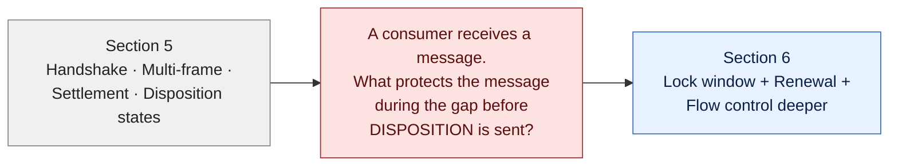
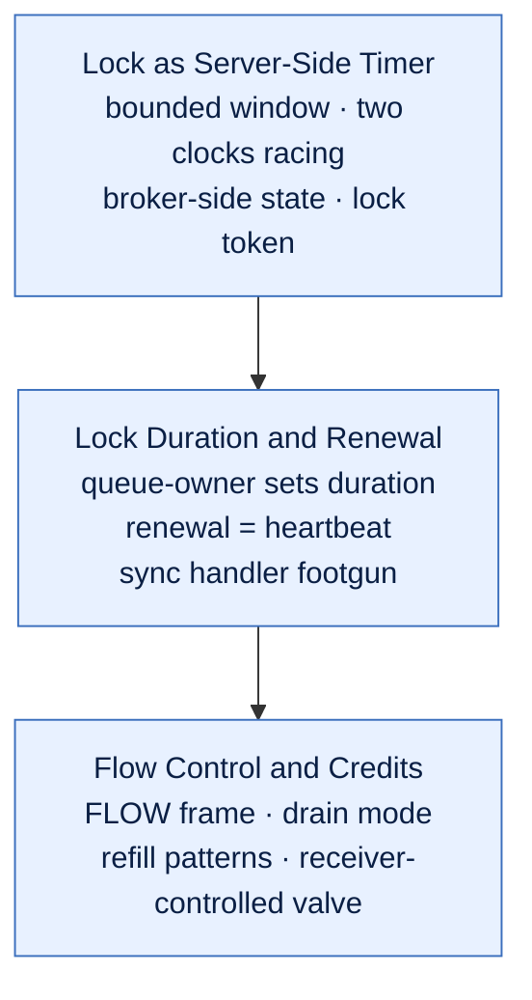

# AMQP Message Lifecycle

> Hub for section 6. Section 5 ended with the four disposition states a receiver can send back. This section zooms in on what happens **between** "broker delivered the message to a consumer" and "consumer sends DISPOSITION" — the lock window, the heartbeat-style renewal, and the FLOW frames that meter the pipe. This is the layer you actually write code against in Service Bus.

## What this section covers

Three pieces, each answering one question a Service Bus engineer hits in production:

1. **What stops two consumers from grabbing the same message?** — the lock as a server-side timer
2. **What happens if my handler is slow — does the lock expire mid-work?** — lock duration & renewal
3. **What controls how many messages are buffered locally before I even call `receive`?** — flow control and credits, deeper

Section 5 introduced settlement at the wire level (TRANSFER + DISPOSITION). Section 6 is the same story from the consumer's seat: *the time window between "I got it" and "I'm done with it" is governed by an active liveness contract, not a static deadline.*

## Bridge from Section 5

The four disposition states from Section 5 (accepted / rejected / released / modified) are *what* the consumer eventually says. This section is *what holds the message in place while the consumer decides*.

## Section flow

## Notes (in order)

- [[Lock as Server-Side Timer]] — when the broker hands a message to a consumer, it starts a bounded timer; the consumer must complete or abandon before it expires; lock token = generation counter; broker-side state survives reconnects, Session-side state doesn't
- [[Lock Duration and Renewal]] — `LockDuration` is set on the queue (default 30s, max 5min); renewal is a heartbeat the broker observes in real time, not a budget extension; auto-lock-renewal exists in modern SDKs but sync-blocking handlers silently starve it; the smoking-gun production debugging pattern
- [[Flow Control and Credits]] — FLOW is the 9th frame verb; receiver-controlled valve (same shape as TCP receive window); drain mode converts "maybe" into yes-or-no; threshold-based refill is why `prefetch_count` matters more than handler speed for throughput

## The unifying mental model

Three things in this section look unrelated on the surface but share one shape:

| Thing | Active proof of liveness | What happens on silence |
|---|---|---|
| **Lock** | Renewal frames | Broker reclaims the message |
| **Connection** | Heartbeat frames | Broker tears down + releases all locks |
| **Credits** | FLOW frames | Sender stays starved |

> **Active liveness > static trust.** AMQP's design choice everywhere in this section: the receiver/consumer must *keep proving it's alive*, and silence means the broker reclaims control. This is the same pattern as TCP keepalives, Raft heartbeats, OAuth refresh tokens, Redis distributed lock TTL+renew. Once you've named it, you'll see it everywhere.

## Where this fits

Section **6 of 11**. Section 5 explained what flows on the wire to send a message. Section 6 explains the time-bounded contract that protects a message while a consumer is processing it. Section 7 (Message Structure) drops back into the message body itself — header, properties, application properties, body, footer.

[[Index]]
