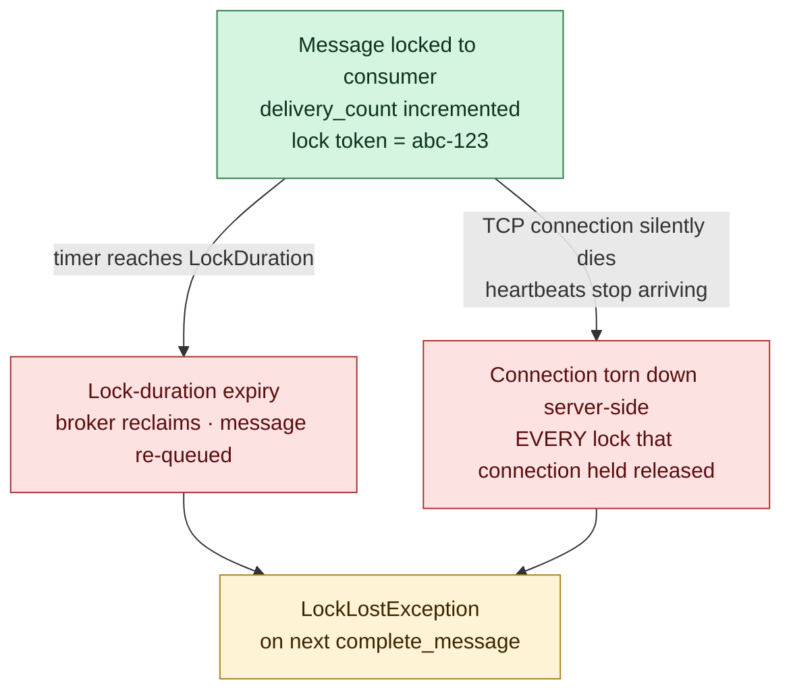

---
tags:
  - amqp
  - servicebus
  - lifecycle
---

# Lock as Server-Side Timer

> **When a broker hands a message to a consumer, it doesn't trust the consumer to finish — it starts a bounded server-side timer.** The consumer has until the timer expires to send DISPOSITION (`Complete` / `DeadLetter` / `Abandon`). If silence lasts longer than the lock duration, the broker reclaims the message and gives it to someone else. The lock is short-lived, broker-side, and unforgeable — three properties together that make a queue safe under crashes, network blips, and rolling deploys.

## Definition

A **lock** is a bounded, server-side time window during which one consumer has exclusive rights to settle (Complete / DeadLetter / Abandon) a specific message. The broker creates the lock the moment it sends the TRANSFER frame, stamps the message with a **lock token** (a GUID it generates), and starts a per-message timer of `LockDuration` length. The consumer's only options before the timer expires:

- **Settle it** (`Complete`, `DeadLetter`, `Abandon`) — terminates the lock immediately.
- **Renew it** (extend the timer — see [[Lock Duration and Renewal]]).
- **Stay silent** — the broker reclaims the message at expiry and redelivers it.

The lock is not a row-level database lock, not a broadcast, not a permanent assignment. It's a *clock the broker runs on the consumer's behalf*.

## Problem it solves

Sections 1–5 established that a queue holds messages and consumers pull from it. But once a broker sends a message to consumer A, it has to decide: **what should it tell consumer B who's polling the same queue right now?**

Three crude options exist, and all three are wrong:

| Option | What breaks |
|---|---|
| **(a) Send the message to both A and B** | If A and B are different replicas of the same app, both will execute the side effect — double charge, double email, double DB write. Fine for events/topics; wrong for queues. |
| **(b) Lock the message permanently to A** | If A crashes mid-processing, the message is stuck forever — a poison pill that hides the message from every other consumer. A rolling deploy that crashes 0.1% of pods silently loses thousands of messages. |
| **(c) Lock the message to A for a bounded time, then reclaim if silent** | Bounded window: A's crash isn't fatal; the message comes back. Only one consumer at a time: no double-charge. This is the Service Bus design. |

Option (c) is the lock. It's a *timed exclusive grant* — exclusive enough to prevent duplicates from happening simultaneously, time-bounded enough that no failure mode hides the message forever.

## Why previous solution was insufficient

A naive design would put the locking on the consumer side: *"the SDK marks the message as 'in progress' in its local memory, and processes one at a time."* This collapses the moment you have more than one consumer process:

- Consumer A's local "in progress" set is invisible to consumer B's local "in progress" set.
- Both consumers happily pick up the same message from the queue.
- Both run the handler. Both call `Complete`. Customer is charged twice.

The defense **must** live at the broker, because the broker is the only entity that sees all consumers. Anything below the broker (consumer-side library, OS, shared memory, distributed lock service) is more complex and more failure-prone than a server-side timer.

> **The broker doesn't trust the consumer. It trusts its own clock.**

## Responsibilities

The lock owns:

- **Exclusive grant** — exactly one consumer holds the lock at any moment.
- **Bounded time window** — the lock dies on its own at `LockDuration` even if the consumer never speaks again.
- **Generation tracking** — the lock token changes every time the message is re-locked, so a stale consumer can't accidentally settle a delivery the broker has already given to someone else.
- **Reclamation on silence** — when the timer fires without a DISPOSITION, the broker increments `delivery_count` and re-queues the message.

What it does *not* own:

- **Durability** — the message body lives in the queue's persistent storage, not the lock. Locks come and go; the message is unaffected.
- **Routing** — the lock doesn't choose which consumer gets the message next; the queue's polling order does.
- **Retry limits** — `MaxDeliveryCount` is a separate broker-side counter on the message itself, not on the lock.
- **Cross-message ordering** — locks are per-message, not per-consumer.

## Two clocks racing — the part everyone misses

The lock can die in **two unrelated ways**, and the consumer code has to handle both as the same outcome:



| Death mode | What triggered it | How much wall-clock time was left? |
|---|---|---|
| **Lock-duration expiry** | Consumer was too slow / sync-blocked / deadlocked | Zero — the timer ran out |
| **Heartbeat failure** | TCP link silently died (router reboot, NAT timeout, machine power loss) | **Could be anything** — even 29s remaining on a 30s lock |

Both look identical from inside the handler — `complete_message` raises `LockLostException`. The defense is the same: **idempotency on every side effect**, so the duplicate that the next consumer processes is harmless.

> **`LockLostException` doesn't always mean "you were too slow." Half the time it means "your TCP died and came back, the broker handed your message to a different consumer during the gap, and now the work you just did is going to repeat."**

This is why "the consumer was fast, why is the lock lost?" is a misleading question. The right question is "is every side effect in my handler safe to repeat?"

## Broker-side state vs Session-side state

This is the cleanest tie-back to Section 4's "[[Session]]s don't survive crashes" anchor.

| Lives on | Survives reconnect? | Examples |
|---|---|---|
| **Session notebook** (client + broker, per-Connection) | ❌ No — wiped on Session end | Outgoing/incoming `delivery-id` counters, channel→Session map, in-flight delivery tracking |
| **Message itself** (broker-side persistent store) | ✅ Yes | `delivery_count`, lock token, lock expiry timestamp, `MaxDeliveryCount` enforcement, message body, application properties |

Why the split matters: imagine `delivery_count` lived in the Session notebook. A consumer crashes mid-processing, reconnects, opens a fresh Session — the notebook is empty. Every reconnect would reset `delivery_count` to zero. The auto-DLQ safety net (`MaxDeliveryCountExceeded`) would silently fail on the **exact** failure mode it was designed to catch: a poison message that crashes consumers repeatedly.

> **Pattern:** anything the broker needs to remember across reconnects must live on the **message**, never in the **Session notebook**. Service Bus is the source of truth; the consumer is just visiting.

## Lock token — coatcheck ticket / generation counter

Every time the broker locks a message it generates a fresh **lock token** (a GUID) and stamps it on:

- the TRANSFER frame the consumer receives, and
- the broker's own per-message state.

To `Complete` / `Abandon` / `DeadLetter`, the consumer sends DISPOSITION carrying the token back. The broker matches token → honors the verb.

Why a token at all and not just message-id? Because the same message can be locked **multiple times** in its life:

```
T=0    Pod A locks msg-7   token = abc-123    delivery_count = 1
T=30s  Pod A's lock expires (sync-blocked handler)
T=30s  Pod B locks msg-7   token = def-456    delivery_count = 2
T=45s  Pod A finally finishes processing → calls complete_message
       sends DISPOSITION with token = abc-123
       broker: "that token is stale" → LockLostException
T=46s  Pod B sends DISPOSITION with token = def-456 → honored
```

Without the token, Pod A's late `complete_message` would silently delete a message Pod B was happily processing. The token is what lets the broker say *"that lock is stale"* — it's a generation counter as much as an identifier.

The SDK hides the token under the message object for `complete_message` / `abandon_message`, but exposes it as `msg.lock_token` for explicit renewal flows.

## Real-world example

A payment-processing service runs 8 replicas behind a Service Bus queue. Each replica's handler does: validate → call payment gateway → write to Postgres → `Complete`.

**Without the lock:** all 8 replicas poll the queue at the same time. Each receives `payment-msg-9921`. All 8 call the payment gateway. Customer is charged 8 times.

**With the lock (Service Bus default `PeekLock` mode):**

```
Pod 3 polls    →  broker locks msg-9921 to Pod 3 (30s timer, token = ghi-789)
Pod 5 polls    →  broker skips msg-9921 (already locked), gives it msg-9922
Pod 1 polls    →  msg-9923
...
```

Only Pod 3 sees `msg-9921`. The other 7 pods get other messages. No duplicate charge.

What if Pod 3 crashes 5s in? The 30s timer keeps running on the broker. At T=30s, the broker reclaims `msg-9921`, increments its `delivery_count` to 2, and the next poll from Pod 1 picks it up. Pod 1 charges the card. **Wait — was it already charged once by Pod 3?**

This is exactly why every payment handler needs a **dedup table keyed on `MessageId`**:

```python
async def handle(msg):
    msg_id = msg.message_id
    if await dedup.has(msg_id):       # already processed in a previous lifetime
        await receiver.complete_message(msg)
        return
    await charge_card(msg.body)
    await dedup.add(msg_id)
    await receiver.complete_message(msg)
```

The lock prevents *simultaneous* duplicate charges. Idempotency prevents *sequential* duplicate charges (after a crash + retry). You need both.

## Mental model

> **The lock is a parking meter the broker runs on your behalf.**
>
> When you arrive at a parking spot, the meter starts a 30-minute timer in *the city's clock*, not yours. To stay longer, you have to feed the meter (renew). If you walk away without paying or the meter runs out, the city tows your car (the broker reclaims the message and gives it to the next consumer in line).
>
> The receipt the meter prints (the **lock token**) has a unique number for *this* parking session. Come back two hours later with an old receipt and try to claim the spot — the meter says "that ticket is from a session that already ended, the spot's been re-rented." That's `LockLostException`.

## Interview answer

When a Service Bus consumer receives a message under PeekLock mode, the broker doesn't trust the consumer to finish — it locks the message server-side with a bounded timer, default 30 seconds, max 5 minutes. The consumer has to send DISPOSITION (Complete / DeadLetter / Abandon) before the timer expires, otherwise the broker reclaims the message, increments `delivery_count`, and redelivers it. The lock can die in two ways: lock-duration expiry (consumer was too slow), or connection heartbeat failure (TCP died and the broker tore down every lock that connection held). Both surface as `LockLostException` at the SDK level, and the defense is the same — every side effect in the handler must be idempotent. The lock is identified by a fresh **lock token** generated each time the message is locked, which prevents a stale consumer from settling a delivery that's been re-locked under a different generation. The reason `delivery_count` and the lock token live broker-side, not in the AMQP Session, is that the Session is wiped on every reconnect — Service Bus is the source of truth; the consumer is just visiting.

## Common misconceptions

- **"The lock is broadcast to all consumers."** No. It's a server-side timer on the broker. Other consumers just see the message as "not available" while the lock holds.
- **"`LockLostException` always means the consumer was too slow."** No. It can also mean the TCP connection silently died and the broker reclaimed every lock that connection held — even with most of the lock duration unused.
- **"Lock tokens are just identifiers."** They are also generation counters. The same message gets a fresh token every time it's locked, which is what makes "settle by token" safe across re-locking.
- **"`delivery_count` lives in the Session."** No. It lives on the message, broker-side. Sessions die; the count survives.
- **"Renewing the lock is dangerous because the consumer controls it."** Renewal is a heartbeat the broker observes in real time. A frozen consumer can't send renewals — see [[Lock Duration and Renewal]].
- **"Once locked, a message can't be processed by anyone else ever."** Wrong by design. Locks expire on silence; that's the whole point — a crashed consumer can't hide a message forever.
- **"`Complete` after a `LockLostException` is fine, the message is processed."** No. The broker rejected your settlement; the message is somewhere else now (already redelivered, possibly already completed by the new consumer). Treat `LockLostException` as "I have no idea who owns this message anymore" and rely on idempotency to protect side effects.

## See also

- [[Lock Duration and Renewal]] — how to extend the timer when handlers legitimately need more time
- [[Disposition States]] — what consumers actually send to terminate the lock
- [[Settlement Modes]] — the wider settlement story this lock fits into
- [[Session]] — the "Sessions don't survive crashes" anchor that this note depends on
- [[Idempotency]] — the consumer-side defense that makes lock-loss recoverable

## Index

[[AMQP Message Lifecycle]]
