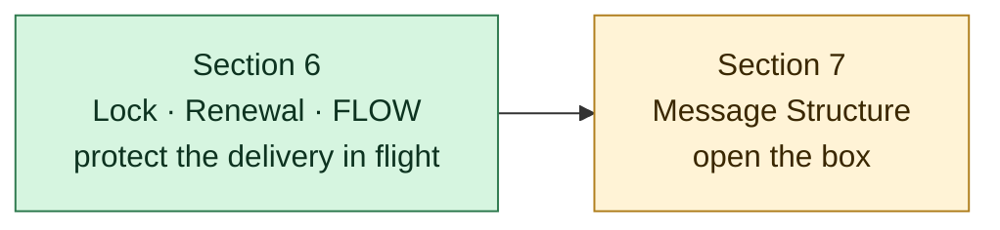
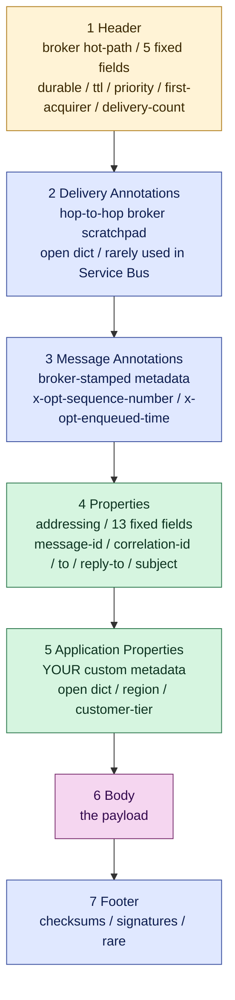

---
tags:
  - moc
  - amqp
  - message-structure
---

# Section 7 — AMQP Message Structure

> The shape of a message itself. Six sections, each owned by a different actor (producer / broker / consumer), each read at a different point in the message's life. Closed-list sections (Header, Properties) for interoperability; open-dict sections (Annotations, Application Properties) for extensibility. The 6-section split is what makes brokers fast and vendor extensions safe — both at the same time.

## What this section covers

So far we've been treating "the message" as a black box inside a TRANSFER frame. This section opens the box.

Up to here the curriculum showed:

- TRANSFER frame carries a delivery (Sections 4–5)
- Multi-frame stitches a large delivery into one atomic unit (Section 5)
- Lock + credits protect the delivery in flight (Section 6)

But what does the message *itself* actually look like inside the frame? That's Section 7.

## Bridge from Section 6

Section 6 was about the *transport contract* once a message is in the consumer's hands. Section 7 is about the *message's own shape* — the bytes a producer assembles and a consumer reads. Different layer, different concerns.

## The 6-section layout

Each section is its own little dictionary with its own owner.

## Closed vs open — the design principle

Two pairs of sections:

| Closed (AMQP-standard, fixed schema) | Open (extensible, vendor/app fills)           |
| ------------------------------------ | --------------------------------------------- |
| **Header** (5 fields)                | **Message Annotations** (`x-opt-` extensions) |
| **Properties** (~13 fields)          | **Application Properties** (your custom data) |

The principle: **closed core for interoperability, open extensions for innovation.** Same pattern shows up in HTTP (standard headers + `X-` extensions), DNS (standard record types + TXT for anything custom), and email (standard MIME headers + `X-` headers).

A field belongs in:

- **Header** — if every AMQP broker on Earth needs to act on it on the hot path (universal + frequent + protocol-defined).
- **Properties** — if every AMQP endpoint (sender or consumer) needs to read it (universal + endpoint-only).
- **Message Annotations** — if a *broker* needs custom metadata (vendor-specific or rarely-needed).
- **Application Properties** — if your *application* needs metadata the broker shouldn't touch.
- **Body** — the payload itself.

This is why Service Bus's `ScheduledEnqueueTimeUtc` is in Message Annotations (`x-opt-scheduled-enqueue-time`) — it's broker-actionable timing, but only Service Bus knows about it. AMQP's standard `ttl` is in Header — every broker on Earth understands it.

## Notes in this section

- ✅ [[Header]] — broker's must-read section; 5 fixed fields; standardised hot-path delivery controls; Service Bus welds `durable=true` for all messages
- ✅ [[Properties]] — addressing fields; ~13 standard slots; `message-id`, `correlation-id`, `subject`, `reply-to`, `group-id` (= Service Bus `SessionId`); how request/reply, dedup, and FIFO ordering are wired up
- ✅ [[Application Properties]] — your custom dict; broker is mostly pass-through but topic filters CAN read it; this is where `tenant_id`, `region`, `customer_tier` go
- ✅ [[Message Annotations]] — broker's open dict; vendor extensions live under `x-opt-`; where `SequenceNumber`, `EnqueuedTimeUtc`, `LockedUntil`, `ScheduledEnqueueTime`, `PartitionKey` all live
- ✅ [[Body]] — the payload; three AMQP shapes (`data` / `amqp-value` / `amqp-sequence`); Service Bus uses `data` exclusively; broker treats it as opaque
- ✅ [[Footer]] — open dict at the tail; carries body-derived checksums/signatures; Service Bus doesn't use it (TLS covers integrity)
- ✅ [[Wire Walkthrough]] — synthesis: trace one message from `send_messages` to broker disk and back, end to end; covers length-prefix framing at three nested levels

## Recognition triggers from this section

- `x-opt-` prefixes in SDK source / packet captures → Message Annotations (vendor extensions)
- `application_properties={...}` in Service Bus SDK → Application Properties
- `msg.message_id`, `msg.correlation_id` in SDK → Properties
- `msg.delivery_count`, `time_to_live` in SDK → Header
- "Header is closed, Annotations is open" — when you can't find where a field goes, ask *is this AMQP-standard or vendor-specific?*

## Index

[[Index]]
