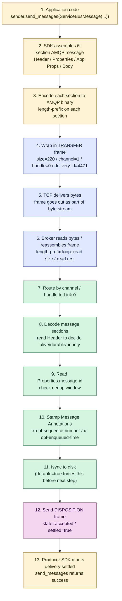

---
tags:
  - amqp
  - message-structure
  - synthesis
---
	
# Wire Walkthrough — One Message, End to End

> **The synthesis note for Sections 4–7.** Trace one Service Bus message from `sender.send_messages(...)` down through the SDK, into TRANSFER frames, across TCP, into the broker's decoder, onto disk, and back out as a DISPOSITION. Every step maps to a concept covered earlier; this note ties them together. Includes how length-prefix framing makes the whole thing work at three nested levels.

## The setup

```python
sender.send_messages(
    ServiceBusMessage(
        body=b'{"order_id": 9931, "total": 4999}',
        message_id="order-9931",
        subject="OrderPlaced",
        correlation_id="cart-77",
        time_to_live=timedelta(hours=1),
        application_properties={"region": "ap-south-1", "tier": "gold"},
    )
)
```

One Python call. We follow what happens until the call returns.

## Step 1 — SDK assembles the 6-section message (in memory)

The SDK builds an AMQP message structure in memory from your Python kwargs:

```
HEADER
    durable        = true              ← SDK welds this on (Service Bus always persists)
    priority       = 4                 (default)
    ttl            = 3_600_000         (1 hour, in ms)
    first-acquirer = true
    delivery-count = 0

DELIVERY ANNOTATIONS
    (empty — Service Bus doesn't use these)

MESSAGE ANNOTATIONS
    (empty for now — broker will stamp x-opt-* on receipt)

PROPERTIES
    message-id     = "order-9931"
    correlation-id = "cart-77"
    subject        = "OrderPlaced"
    creation-time  = 2026-06-23T16:33:21Z   (SDK stamps automatically)

APPLICATION PROPERTIES
    region = "ap-south-1"
    tier   = "gold"

BODY (data section)
    {"order_id": 9931, "total": 4999}        ← your bytes, opaque

FOOTER
    (empty — Service Bus doesn't use this)
```

This is still a Python object — no bytes on the wire yet. Maps directly to [[Header]] / [[Properties]] / [[Application Properties]] / [[Message Annotations]] / [[Body]] / [[Footer]].

## Step 2 — Encode each section to AMQP binary

Each section is serialised into AMQP's binary type-encoding. Roughly:

```
Header        →  ~12 bytes   (5 small fields, mostly compact)
Properties    →  ~80 bytes   (strings: message-id, correlation-id, subject, timestamp)
App Props     →  ~50 bytes   (key-value map)
Body          →  ~38 bytes   (your JSON wrapped in a `data` section)
                  ━━━━━━━━━━
Total         →  ~180 bytes
```

Each section starts with a **descriptor** (a binary tag identifying the section type) and a **length prefix** for the section's content. The decoder reads descriptor → reads length → reads exactly that many bytes → moves on. No delimiters, no scanning the bytes.

This is now 180 bytes of encoded message sitting in the SDK's send buffer.

## Step 3 — Wrap the message in a TRANSFER frame

The 180-byte encoded message is the *payload* of a TRANSFER frame:

```
TRANSFER FRAME (220 bytes total)
┌─────────────────────────────────────────────┐
│ FRAME HEADER (8 bytes)                      │
│   size           = 220                      │  ← length prefix (the key field)
│   doff           = 2                        │
│   type           = 0x00 (AMQP frame)        │
│   channel        = 1                        │  ← AMQP Session ID (Section 4)
├─────────────────────────────────────────────┤
│ PERFORMATIVE (~32 bytes)                    │
│   <transfer descriptor>                     │
│   handle         = 0                        │  ← Link handle (Section 4)
│   delivery-id    = 4471                     │  ← Section 5 anchor
│   delivery-tag   = <16 bytes>               │
│   message-format = 0                        │
│   settled        = false                    │  ← Section 5: unsettled mode (Mode 2)
│   more           = false                    │  ← single-frame message
├─────────────────────────────────────────────┤
│ FRAME PAYLOAD (180 bytes)                   │
│   <encoded AMQP message from Step 2>        │
└─────────────────────────────────────────────┘
```

The frame header tells the broker:
- **`size = 220`** — exactly this many bytes belong to this frame
- **`channel = 1`** — which AMQP Session this frame routes to
- **`handle = 0`** — which Link inside that Session
- **`delivery-id = 4471`** — sender's local counter for this delivery
- **`more = false`** — the message fits in one frame (multi-frame anchor in [[Multi-Frame Messages]])

If the body had been 5 MB, the SDK would have split it across ~80 TRANSFER frames, all on `(channel=1, handle=0, delivery-id=4471)`, with `more=true` on the first 79 and `more=false` on the last.

### Aside — what is `doff`?

`doff` (data offset) tells the parser **where the performative starts inside the frame**. It's measured in 4-byte words.

- `doff = 2` → performative starts at byte 8 → header is the standard 8 bytes
- `doff = 3` → performative starts at byte 12 → there are 4 bytes of extension data between header and performative
- `doff = 5` → performative starts at byte 20 → 12 bytes of extension data

In practice, **every AMQP implementation uses `doff = 2`** — no extensions, fixed 8-byte header. The field exists as a **forward-compatibility hatch**: if AMQP 2.0 ever adds new header fields, `doff` would become 3 or higher in those frames, and old parsers would still find the performative correctly by jumping `doff × 4` bytes from the start.

Important distinction: **`doff` is not a slot for application data.** It's reserved for future AMQP spec extensions. App-specific data goes in [[Application Properties]] (your custom fields) or [[Message Annotations]] (vendor / broker extensions) — both *inside the message*, not in the frame header.

So when you see `doff = 2` in our walkthrough, it just means "standard 8-byte header, no extensions." Always the case for Service Bus.

## Step 4 — Frame goes out over TCP

The 220 bytes are handed to the OS socket:

```
socket.send(<220 bytes of the TRANSFER frame>)
```

TCP doesn't know about AMQP. It sees a byte stream, chops it into TCP segments, adds its own headers (with its OWN length-prefix fields), and ships them. If frames from `channel=1`, `channel=2`, `channel=3` are interleaved on the same Connection, TCP transmits them as one undifferentiated stream:

```
[ TCP segment ]
  [ frame channel=1 ] [ frame channel=2 ] [ frame channel=1 ] [ ... ]
```

TCP's job is "deliver bytes in order." AMQP's job is "split those bytes back into frames." That's the [[Frames]] / Section 4 anchor — *frames ≠ TCP packets, two reassembly layers.*

## Step 5 — Length-prefix framing on the broker side (the key mechanism)

The broker has a TCP socket open. Bytes arrive in whatever sized chunks TCP delivers — could be 50 bytes, could be 5000, could be partial frames split across segments. The broker doesn't care about TCP segment boundaries. It runs a tight loop:

```
loop:
    read exactly 4 bytes from the socket  →  this is `size`
    interpret as big-endian uint32         →  N
    read exactly (N - 4) more bytes        →  rest of the frame
    hand the complete frame to the dispatcher
```

That's the entire framing loop. **Length-prefix turns "an unbounded byte stream" into "a sequence of discrete frames"** with O(1) work per frame.

### Why length-prefix and not delimiters

If AMQP had used a delimiter (`END-FRAME` marker bytes), every byte of the payload would have to be scanned to find the next delimiter. Worse, your payload contains arbitrary binary — your JSON might happen to contain bytes matching the delimiter, splitting the frame at the wrong place. You'd need escape characters, doubling parser complexity. See [[Message Boundaries]] in Section 3.

With length-prefix:
- Reader **does not scan the payload at all**
- Payload bytes can be anything (binary, encrypted, random)
- Frame boundary decode is O(1), independent of frame size

This is why HTTP/2, gRPC, AMQP, and TCP itself all use length-prefix. Once you have mixed-type binary payloads, length-prefix is essentially the only sane choice.

### Three nested levels of length-prefix in our flow

```
TCP segments         ← length prefix in TCP header (OS handles)
  AMQP frame         ← length prefix in frame header (size=220)
    Message sections ← length prefix on each section
      Body data      ← length prefix on the data section's bytes
        raw JSON     ← finally, your actual payload bytes
```

Four layers of nested length-prefix reads. No delimiters anywhere in the entire stack. No byte-scanning. Each layer reads its length, consumes that many bytes, hands them to the next layer up.

This is what makes [[Multi-Frame Messages]] possible — the broker knows where one TRANSFER ends and the next begins, even though they're back-to-back on the wire with no separator. This is what makes [[Frames|multiplexing]] work — frames from different channels can be interleaved arbitrarily and the broker can still untangle them.

## Step 6 — Broker routes the frame

Now the broker has one complete frame (220 bytes) sitting in memory.

1. Reads `channel=1` → routes to **AMQP Session #1's handler**
2. Sees the frame's performative is TRANSFER → it's a delivery
3. Reads `handle=0` → routes to **Link #0's handler** inside Session 1
4. Link 0 is configured as *receiver from producer* targeting `orders-queue`

Routing is finished. The broker has not yet looked at the message inside the frame — it's just been dispatching the frame envelope to the right internal handler.

## Step 7 — Broker decodes the message sections

Now the broker decodes the 180-byte payload into the 6 sections.

### a) Header — the broker's hot-path decisions

```
Reads: durable=true, ttl=3_600_000, priority=4, delivery-count=0
```

The broker checks:
- *Has TTL expired?* `creation-time + ttl > now` → yes, alive → continue
- *Should I persist?* `durable=true` → must fsync before sending DISPOSITION
- *Priority?* 4 (default) → normal queue position

If TTL had been 0 and creation-time was an hour ago, the broker would drop the message here without reading the rest. This is the [[Header]] anchor — "broker reads Header on every hop to make immediate accept/drop calls."

### b) Properties — addressing and dedup

```
Reads: message-id="order-9931", correlation-id="cart-77", subject="OrderPlaced"
```

- **`message-id = "order-9931"`** — checks the dedup window. Has this exact message-id been seen recently? If yes → drop silently as a duplicate. This is the Section 5 anchor: Service Bus delivers exactly-once via broker-side dedup keyed on `MessageId`, NOT via AMQP Mode 3.
- **`subject`** — would be used by topic filters if this were a topic. For a queue, it's just stored.
- **`correlation-id`** — stored; used later if the consumer wants to correlate to a request.

### c) Application Properties — for filters (and storage)

```
Reads: region="ap-south-1", tier="gold"
```

If the destination were a **topic** with subscription filters like `tier = 'gold'`, the broker would evaluate them against this dict. Since it's a queue, the broker just stores the dict alongside the message (no filter evaluation needed).

This is the only time the broker peeks into [[Application Properties]] — for filter evaluation. Otherwise it's pass-through.

### d) Body — opaque

```
Reads: 38 bytes of `data` section
```

The broker does **not** decode the JSON. It stores the bytes as-is. The consumer will decode based on `Properties.content-type`. See [[Body]] — *"the broker treats the body as opaque"*.

## Step 8 — Broker stamps Message Annotations and persists

The broker writes its own metadata into [[Message Annotations]]:

```
MESSAGE ANNOTATIONS (broker-stamped, written now)
    x-opt-sequence-number = 4471                  ← global queue position
    x-opt-enqueued-time   = 2026-06-23T16:33:21Z
```

Then it persists the **complete message** (now with annotations filled in) to disk:

```
fsync to disk:
    [Header][Properties][App Props][Annotations][Body][Footer]
```

Only after fsync completes does the broker proceed to step 9. This is the Section 5 anchor — `durable=true` welds the producer's flag to "DISPOSITION-after-fsync" at the broker side. The message is now safely on disk; a power-cycle wouldn't lose it.

## Step 9 — Broker sends DISPOSITION back

The broker constructs a [[Disposition States|DISPOSITION]] frame:

```
DISPOSITION FRAME
┌─────────────────────────────────────────────┐
│ FRAME HEADER (8 bytes)                      │
│   size           = ~30                      │  ← length prefix again
│   channel        = 1                        │
├─────────────────────────────────────────────┤
│ PERFORMATIVE                                │
│   <disposition descriptor>                  │
│   role           = receiver                 │  (broker is receiver from producer)
│   first          = 4471                     │
│   last           = 4471                     │
│   settled        = true                     │
│   state          = accepted                 │  ← Section 5: terminal state
└─────────────────────────────────────────────┘
```

This frame goes out over TCP, reaches the producer's SDK.

## Step 10 — Producer SDK marks delivery settled

Producer's framing loop reads the bytes off TCP using the same length-prefix mechanism (size=30 → read 30 bytes → one complete frame).

1. Frame is on `channel=1` → routes to AMQP Session 1
2. Performative is DISPOSITION
3. Looks up `delivery-id=4471` in the Session's notebook (Section 4 anchor: *Session is a notebook of deliveries and their settlement state*)
4. Marks delivery 4471 as settled with `state=accepted`
5. Removes 4471 from the unsettled set
6. Resolves the awaiting `send_messages(...)` call

Your application code's `send_messages(...)` returns success. From your code's perspective, the message is sent. From the broker's perspective, it's durably stored and assigned sequence number 4471.

## The whole flow



## What each layer protected

| Layer | What it guarantees | Section anchor |
|---|---|---|
| TCP | Bytes arrive in order, no loss, no duplicates | Section 2 — [[TCP]] / [[Reliable Byte Transport]] |
| AMQP frames + length-prefix | Frame boundaries findable in O(1), supports binary payloads, multi-frame stitching | Section 4 — [[Frames]] |
| AMQP Session (channel) | Many conversations multiplexed over one TCP socket | Section 4 — [[Session]] |
| AMQP Link (handle) | One-way pipe with credit-based flow control | Section 4 — [[Link]] |
| Message structure (6 sections) | Standardised slots so broker reads only what it owns | Section 7 — [[AMQP Message Structure]] |
| `durable=true` (Header) | Forces broker to fsync before sending DISPOSITION | Section 7 — [[Header]] |
| DISPOSITION (settled=true, accepted) | Producer learns *"the broker has it, durably"* | Section 5 — [[Disposition States]] |
| Broker dedup on `message-id` | Exactly-once even on producer retries | Section 5 — [[Settlement Modes]] |

Pull any one of these out and a guarantee disappears. That's why the curriculum was bottom-up — each layer assumes the one below it is doing its job.

## Mental model

> **Length-prefix is the floor under everything.** The broker never has to scan bytes looking for delimiters; it always knows exactly how many bytes to read next. That's what makes binary multiplexing, multi-frame messages, and high-throughput parsing possible — the framing decision in Section 3 is what every layer above silently relies on.
>
> A message moves through the stack like a Russian doll being unpacked: TCP gives you a byte stream, length-prefix gives you frames, frames give you a Session/Link routing context, the message inside gives you 6 sections of structured metadata, the body inside that gives you your actual JSON. Five layers of decoding, each one O(1) thanks to length-prefix.

## Common misconceptions

- **"AMQP frames are TCP packets."** No. TCP packets are network-layer chunks; AMQP frames are protocol-level messages. They live at different layers; one TCP packet may carry pieces of multiple frames or a single frame may span multiple TCP packets. See the Section 4 anchor *frames ≠ packets, two reassembly steps*.
- **"The broker decodes my JSON to evaluate filters."** No. Filters can read [[Header]], [[Properties]], and [[Application Properties]]. The [[Body]] is opaque to the broker. Anything that should drive filtering must live in App Props, not the body.
- **"Once `send_messages` returns, my message is on the consumer."** No. It returns when the broker has accepted (and persisted) the message. The consumer hasn't seen it yet — that's a separate delivery via a TRANSFER frame on the consumer's Link.
- **"Length-prefix is just a small implementation detail."** No. It's the bedrock that makes binary multi-frame multiplexing possible. Without it, AMQP couldn't carry binary payloads, couldn't multiplex sessions, and couldn't split large messages across frames.
- **"`size` in the frame header includes only the payload."** No. `size` covers the entire frame including the size field itself. So `size=220` means "the next 220 bytes total, counting these 4 size bytes I just read."

## See also

- [[Message Boundaries]] — Section 3, the framing schemes (delimiter / length-prefix / fixed) AMQP chose between
- [[Frames]] — Section 4, the AMQP framing format
- [[Multi-Frame Messages]] — Section 5, how length-prefix enables `more=true` stitching
- [[Settlement Modes]] — Section 5, the `unsettled` mode this walkthrough used
- [[Disposition States]] — Section 5, the `accepted` state the broker sent back
- [[Header]] — Section 7, the broker's hot-path section
- [[AMQP Message Structure]] — Section 7, the 6-section overview

## Index

[[AMQP Message Structure]]
