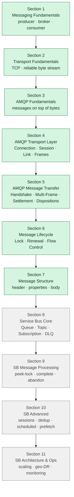

# Azure Service Bus — Master Index

> The full path from raw bytes on a wire up to Service Bus operations. Built bottom-up: TCP → AMQP → Service Bus.

## How this is organized

11 sections. Each section has its own folder and its own MoC (map-of-content) note.

The order matters — earlier sections build the foundation later sections rely on. Don't skip ahead.

Legend: ✅ done · 🚧 in progress · ⏳ not started

## The whole curriculum at a glance

**The arc:** raw bytes (Sections 1–2) → messages with structure (Sections 3–7) → managed messaging product (Sections 8–11). Each layer's existence is justified by the gap the previous one left open.

---

## Section 1 — [[Messaging Fundamentals]] ✅

The basics — before any protocol. Just programs talking to each other.

- [[The Raw Substrate]] — three programs, two wires, bytes on the wires
- [[Producer]] — builds, sends, waits for ack
- [[Messages]] — self-contained unit of data + metadata
- [[Broker]] — long-running program with disks; the two-ack model
- [[Consumer]] — pulls (not pushed), processes, sends second ack
- [[Command]] — *"do this"*, one receiver, can be rejected
- [[Event]] — *"this happened"*, past tense, many subscribers, immutable
- [[Notification]] — informs a known external audience (email, SMS)
- [[Query]] — asks for info, expects reply, never changes state (CQRS)
- [[Delivery Semantics]] — at-most-once / at-least-once / exactly-once
- [[Idempotency]] — safe re-processing; partner of at-least-once

---

## Section 2 — [[Transport Fundamentals]] ✅

The wire underneath everything. What TCP gives us, what it doesn't.

- [[TCP]] — what it is and why it exists
- [[Reliable Byte Transport]] — ordered, no-loss, no-duplicate bytes
- [[TCP Connections]] — handshake, state, teardown

---

## Section 3 — [[AMQP Fundamentals]] ✅

Why we need a protocol on top of TCP, and what AMQP adds.

- [[Why AMQP Exists]] — the gaps TCP leaves open
- [[AMQP vs TCP]] — message-oriented on top of byte-oriented
- [[Message Boundaries]] — where one message ends and the next begins
- [[Messaging Semantics]] — what AMQP promises about delivery
- [[AMQP vs HTTP]] — same TCP, different shape of work

---

## Section 4 — [[AMQP Transport Layer]] ✅

The four layers AMQP uses to multiplex many conversations over one TCP connection.

- [[AMQP Protocol Header]] — the 8-byte greeting (`AMQP\x00\x01\x00\x00`) that engages framing before any frame is sent
- [[Connection]] — the front door, one per TCP socket; auth, version, heartbeat
- [[Frames]] — chunks AMQP writes to TCP, channel-tagged for routing
- [[Session]] — conversation context, the notebook of deliveries
- [[Link]] — one-way pipe inside a Session; handle, direction, target/source, credits

---

## Section 5 — [[AMQP Message Transfer]] ✅

How a message actually moves from sender to receiver in AMQP.

- [[Handshake Choreography]] — OPEN → BEGIN → ATTACH → first FLOW → TRANSFER → DISPOSITION; channel 0 = control; setup amortises
- [[Multi-Frame Messages]] — `max-frame-size` is a buffer contract, not a size cap; `delivery-id` + `more` flag glue frames into one atomic delivery
- [[Settlement Modes]] — pre-settled / unsettled / two-phase; Service Bus uses unsettled + broker dedup, not protocol Mode 3
- [[Disposition States]] — accepted / rejected / released / modified; maps onto Service Bus Complete / DeadLetter / Abandon; auto-DLQ at `MaxDeliveryCount`

---

## Section 6 — [[AMQP Message Lifecycle]] ✅

What protects a message between *"broker delivered it"* and *"consumer settles it"* — the time-bounded contract the consumer has to honor.

- [[Lock as Server-Side Timer]] — bounded server-side timer; two clocks racing (lock-duration expiry + heartbeat failure); broker-side state survives reconnects; lock token = generation counter
- [[Lock Duration and Renewal]] — `LockDuration` is set on the queue (default 30s, max 5min); renewal = heartbeat the broker observes in real time; sync-blocking handlers silently starve auto-renewal; smoking-gun debugging pattern
- [[Flow Control and Credits]] — FLOW frame as the 9th verb; receiver-controlled valve (same shape as TCP receive window); drain mode; threshold-based refill; backpressure for free

---

## Section 7 — [[AMQP Message Structure]] ✅

The shape of an AMQP message itself — six sections, each owned by a different actor (producer / broker / consumer). Closed-list sections (Header, Properties) for interoperability; open-dict sections (Annotations, Application Properties) for extensibility.

- [[Header]] — broker's must-read section; 5 fixed fields (durable, priority, ttl, first-acquirer, delivery-count); standardised hot-path delivery controls
- [[Properties]] — addressing fields; ~13 standard slots; message-id, correlation-id, subject, reply-to, group-id (= Service Bus SessionId)
- [[Application Properties]] — your custom dict; broker reads it for topic filters; where tenant_id, region, customer_tier live
- [[Message Annotations]] — broker's open dict; vendor extensions under `x-opt-`; where SequenceNumber, EnqueuedTimeUtc, LockedUntil, ScheduledEnqueueTime, PartitionKey live
- [[Body]] — the payload; three shapes (`data` / `amqp-value` / `amqp-sequence`); Service Bus uses `data`
- [[Footer]] — open dict at the tail; checksums/signatures over the body; Service Bus doesn't use it (TLS covers integrity)
- [[Wire Walkthrough]] — synthesis note: trace a single message from `send_messages` through SDK → frame → TCP → broker decode → fsync → DISPOSITION; explains length-prefix framing at three nested levels

---

## Section 8 — Service Bus Core Concepts ⏳

Now we leave AMQP and get into Service Bus itself.

- Queue — point-to-point, one consumer wins
- Topic — pub/sub, fan-out to many subscriptions
- Subscription — a named "stream" filtered from a topic
- Filters — rules that decide which messages a subscription gets
- DLQ (Dead Letter Queue) — where bad messages go to die

---

## Section 9 — Service Bus Message Processing ⏳

How consumers actually work with Service Bus messages.

- Peek Lock — read without removing, with a timer
- Receive-and-Delete — read and remove in one step
- Complete — *"done, delete it"*
- Abandon — *"give up the lock, redeliver to someone else"*
- Defer — *"set this aside, I'll come back to it"*
- Dead Letter — *"this is bad, move it to DLQ"*

---

## Section 10 — Service Bus Advanced ⏳

Features that solve real production problems.

- Sessions — ordered, grouped messages for one consumer
- Duplicate Detection — broker-level dedup window
- Scheduled Messages — *"deliver this at 3pm tomorrow"*
- Auto Forwarding — chain queues/topics together
- Transactions — group multiple sends/completes atomically
- Prefetch — pull a batch instead of one at a time
- Retry Patterns — exponential backoff, circuit breakers

---

## Section 11 — Service Bus Architecture & Ops ⏳

Running Service Bus at scale.

- Performance Tuning — throughput, latency, partitioning
- Scaling — namespaces, premium tier, partitioning
- Monitoring — metrics, alerts, what to watch
- Geo-DR — disaster recovery setup
- Geo-Replication — active replication across regions
- Security — RBAC, managed identity, network isolation

---

## Progress

Sections 1–7 complete. The full AMQP foundation is now in place — TCP bytes → multiplexed frames → conversation contexts (Sessions/Links) → message transfer → lifecycle protection → message structure. The [[Wire Walkthrough]] note synthesises Sections 4–7 by tracing one message end-to-end through every layer.

Next: Section 8 (Service Bus Core) — Queue, Topic, Subscription, DLQ. We leave AMQP and enter Service Bus's product layer.

The foundation goes: **bytes (TCP) → messages (AMQP) → managed messaging (Service Bus).** Don't skip layers — each one explains why the next exists.
